# Общее описание решения
Данный репозиторий содержит 4 файла с функциями на языке Python, благодаря которым можно получать площади и периметры некоторых геометрических фигур. Для вычислений в решении используются классические математические формулы.

# Описание каждой функции с примерами вызова
## circle.py:
### 1) area(r) 
Возвращает площадь окружности при заданном значении радиуса окружности

Пример вызова: 

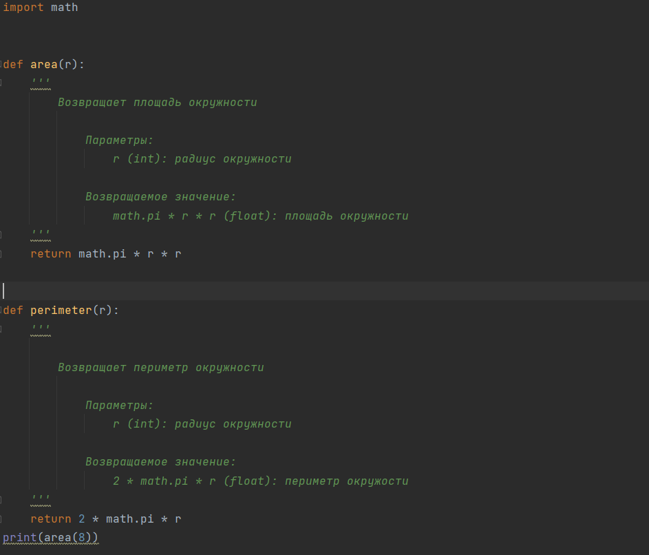

Пример вывода:

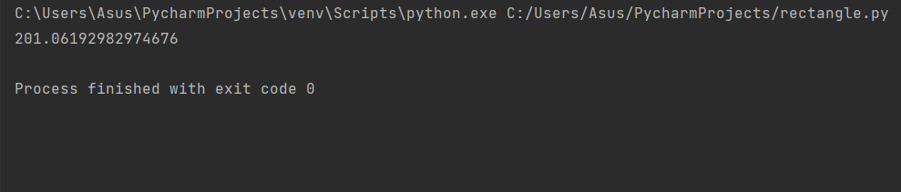

### 2) perimeter(r)
Возвращает периметр окружности при заданном значении радиуса окружности

Пример вызова:

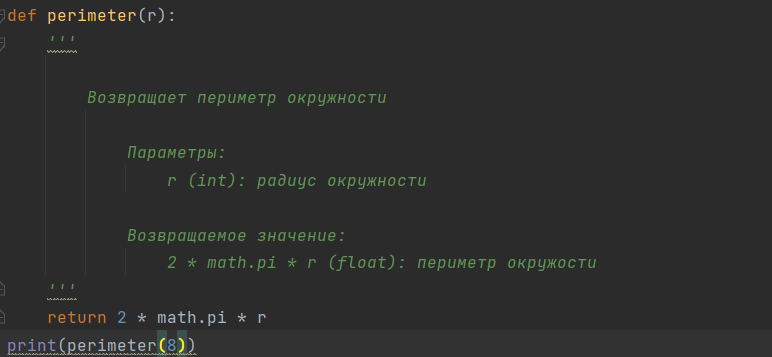

Пример вывода:

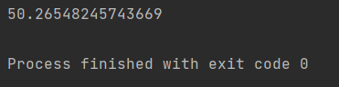

## rectangle.py:
### 1) area(a,b)
Возвращает площадь прямоугольника со сторонами a,b

Пример вызова:

def area(a, b):
    '''
        Возвращает площадь прямоугольника со сторонами a и b

            Параметры:
                a (int): одна сторона прямоугольника
                b (int): вторая сторона прямоугольника (не противоположная)

            Возвращаемое значение:
                a * b (int): площадь прямоугольника
    '''
    return a * b

area(3,4)

Пример вывода:

print(area(3,4))

### 2) perimeter(a,b)
Возвращает периметр прямоугольника со сторонами a,b

Пример вызова:

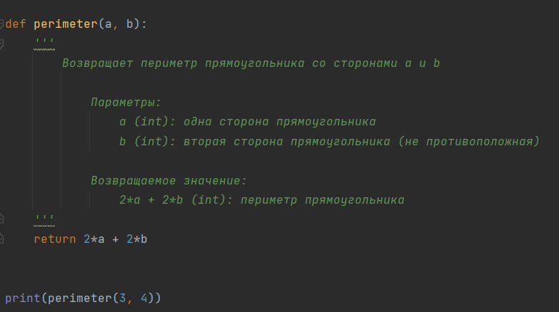

Пример вывода:

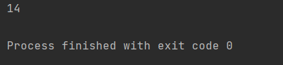

## square.py
### 1) area(a)
Возвращает площадь квадрата со стороной a

Пример вызова:

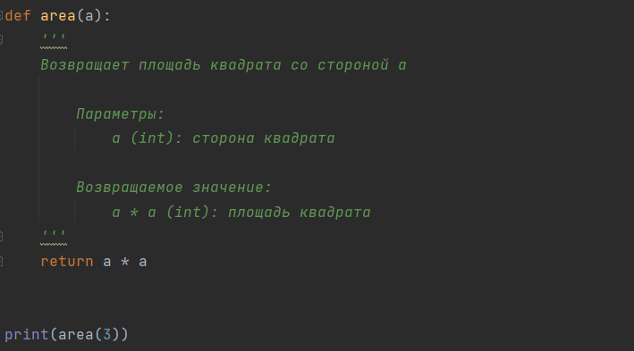

Пример вывода:

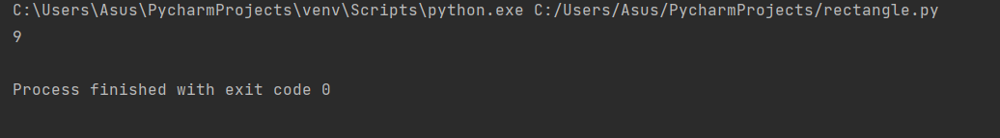

### 2) perimeter(a)
Возвращает периметр квадрата со стороной a

Пример вызова:

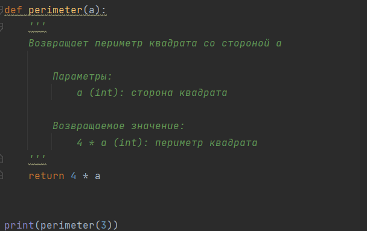

Пример вывода:

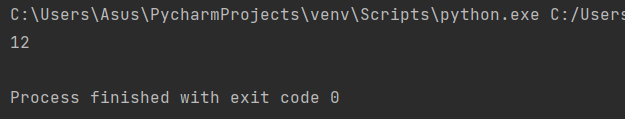

## triangle.py
### 1) area(a,h)
Возвращает площадь треугольника со стороной a и высотой к ней h

Пример вызова:

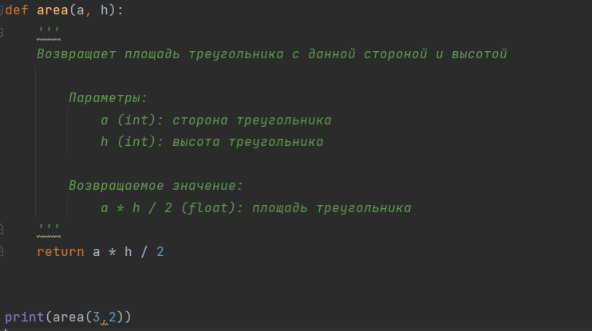

Пример вывода:

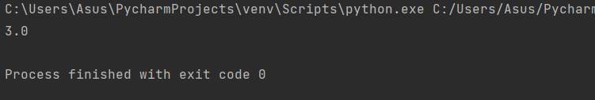

### 2) perimeter(a,b,c)
Возвращает периметр треугольника со сторонами a,b,c

Пример вызова:

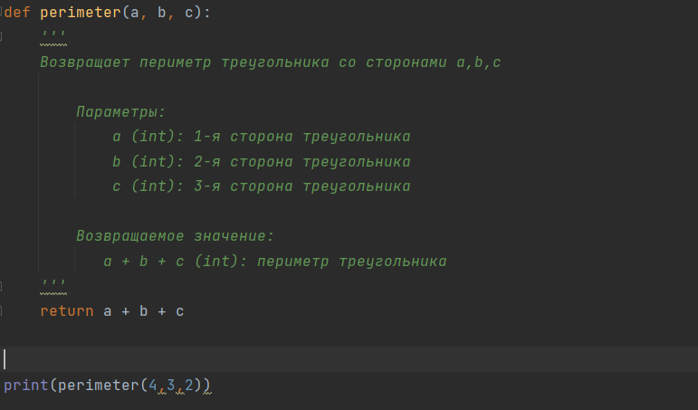

Пример вывода:

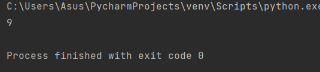

# История изменения проекта с хешами коммитов:

1) Был добавлен новый файл rectangle.py для вычисления периметра и площади прямоугольника. (Хеш коммита - 9a89260)
2) Исправлена ошибка в файле для вычисления периметра и площади прямоугольника. Добавлен файл для вычисления периметра и площади прямоугольника. (Хеш коммита - 82472bc)
3) Добавлен комментарий к работе функций area и perimeter в файле circle.py (Хеш коммита - a63b87f)
4) Добавлен комментарий к работе функций area и perimeter в файле rectangle.py (Хеш коммита - 805fce8)
5) Добавлен комментарий к работе функций area и perimeter в файле square.py (Хеш коммита - ac5747a)
6) Добавлен комментарий к работе функций area и perimeter в файле triangle.py (Хеш коммита - 8a54543)
